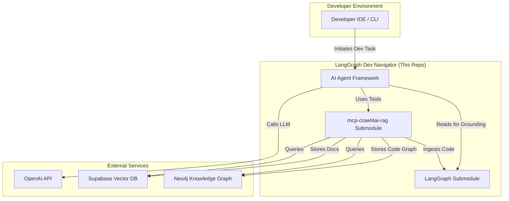

# META_DOC: The Developer's Guide to LangGraph Dev Navigator

This document is the single source of truth for understanding, running, and
contributing to the `langgraph-dev-navigator`. It is designed for both
human developers and AI agents to get up to speed quickly.

## 1️⃣ Overview

This repository provides a framework to enhance AI-assisted development of
[LangGraph](https://github.com/langchain-ai/langgraph) applications. It
grounds AI agents with version-controlled documentation, Retrieval-Augmented
Generation (RAG), and a code Knowledge Graph (KG) to ensure generated code is
accurate, runnable, and aligned with best practices.

### Key features

*   **Grounded AI Development:** Uses a local `langgraph` submodule as the
    source of truth, preventing code generation based on outdated public data.
*   **RAG & Knowledge Graph:** A dedicated server (`mcp-crawl4ai-rag`) provides
    tools to ingest documentation for semantic search and parse Python code
    into a graph database to validate AI-generated code against the actual
    codebase, reducing hallucinations.
*   **Metric-Driven Enhancement:** Treats the improvement of AI assistance as a
    scientific endeavor, with defined success metrics like hallucination
    reduction and increased developer autonomy.
*   **Structured Rules & Playbooks:** Provides clear instructions and rules for
    AI agents to follow, ensuring a transparent and reproducible development
    process.

### Table of contents

*   [1️⃣ Overview](#1️⃣-overview)
*   [2️⃣ Quick Start](#2️⃣-quick-start)
*   [3️⃣ System Architecture](#3️⃣-system-architecture)
*   [4️⃣ Key Modules & Data Flows](#4️⃣-key-modules--data-flows)
*   [5️⃣ Build & Run](#5️⃣-build--run)
*   [6️⃣ Deployment Pipeline](#6️⃣-deployment-pipeline)
*   [7️⃣ Operational Playbook](#7️⃣-operational-playbook)
*   [8️⃣ Contribution Guide](#8️⃣-contribution-guide)
*   [9️⃣ ADR Index](#9️⃣-adr-index)
*   [Changelog](#changelog)

## 2️⃣ Quick start

This one-command bootstrap clones the repository and its submodules.

```bash
# Clone the repo and its submodules
git clone --recursive https://github.com/botingw/langgraph-dev-navigator.git
cd langgraph-dev-navigator

# Set up the Python environment using Conda
conda create --name langgraph-dev python=3.12 -y
conda activate langgraph-dev

# Install dependencies
pip install -r requirements.txt

# Start the RAG & KG server (see mcp-crawl4ai-rag/README.md for .env setup)
./mcp-crawl4ai-rag/start_mcp_server.sh
```

### Status badges


## 3️⃣ System architecture

The system is composed of a primary application that uses AI agents for
development, a submodule for knowledge ingestion and retrieval, and the
LangGraph library itself as a source of truth.



### Component walk-through

*   **Developer Environment:** The user's IDE or command line, where the AI
    assistant is invoked to perform a development task.
*   **AI Agent Framework:** The core logic of this repository. It equips an AI
    agent with tools and a structured workflow to interact with the other
    components.
*   **LangGraph Submodule:** A specific, version-controlled clone of the
    `langgraph` library. It serves as the definitive source of truth for both
    code and documentation, used for RAG/KG ingestion and direct reading.
*   **mcp-crawl4ai-rag Submodule:** A standalone server that provides the
    heavy-lifting capabilities:
    *   It **ingests** documentation from the `langgraph` submodule into a
        Supabase Vector DB for RAG.
    *   It **parses** Python code from the `langgraph` submodule into a Neo4j
        Knowledge Graph for code analysis and hallucination checking.
    *   It exposes these capabilities as **tools** (e.g., `perform_rag_query`,
        `check_ai_script_hallucinations`) for the AI agent to use.
*   **External Services:**
    *   **OpenAI API:** Provides the core intelligence (LLM) for the AI agent.
    *   **Supabase/Neo4j:** The managed databases providing the persistence layer
        for the RAG and KG systems, respectively.

## 4️⃣ Key modules & data flows

The repository is organized to separate concerns between the AI agent's
operating environment, the knowledge sources, and the tooling.

| Folder | Responsibilities | Key Contracts & Data | Testing Strategy |
| :--- | :--- | :--- | :--- |
| **`langgraph/`** | The source of truth for all LangGraph code and documentation. | Official library code (`.py`), documentation (`.md`), and examples (`.ipynb`). | N/A (External submodule) |
| **`mcp-crawl4ai-rag/`** | Provides RAG and KG services. Clones, parses, chunks, embeds, and stores data. Exposes tools to the agent. | `ingestion_engine.py` orchestrates ingestion. `crawl4ai_mcp_botingw.py` defines agent tools (to let mcp-crawl4ai-rag fork avoid merge conflict, `crawl4ai_mcp.py` , `utils.py` , `parse_repo_into_neo4j.py` do not change and bypassed by `{filename}_botingw.py` ). Returns JSON reports. | Unit/integration tests on the ingestion engine (`test_build_langgraph_docs_knowledge.py`). |
| **`memory/`** | The project's "brain." Contains high-level strategy, product requirements, and task plans. | `product_requirement_docs.md` defines goals. Task plans track progress. | N/A (Documentation) |
| **`langgraph_dev/`** | Contains instructions, playbooks, and scripts specifically for guiding the AI agent's development process. | `.md` files with explicit instructions for the AI on how to approach tasks. | N/A (Documentation) |
| **`tools/`** | Simple, standalone Python scripts that can be used by the AI agent for local operations. | `llm_api.py`, `web_scraper.py`, etc. | Manual execution. |

## 5️⃣ Build & run

The primary runnable component is the `mcp-crawl4ai-rag` server.

### Environment variables

The behavior of the `mcp-crawl4ai-rag` server is controlled by environment
variables defined in its `.env` file. See the submodule's `README.md` for a
full list. Key flags include:

```bash
# Enables parsing code into the Neo4j knowledge graph
USE_KNOWLEDGE_GRAPH=true

# Enables RAG features using Supabase
USE_AGENTIC_RAG=true

# Enables hybrid search (keyword + vector)
USE_HYBRID_SEARCH=true

# Enables a re-ranking model for search results
USE_RERANKING=true
```

### Key commands

*   **Install dependencies:** `pip install -r requirements.txt`
*   **Start the server:** `bash ./mcp-crawl4ai-rag/start_mcp_server.sh`
*   **Run the ingestion engine test:** `python mcp-crawl4ai-rag/test_build_langgraph_docs_knowledge.py`

## 6️⃣ Deployment pipeline

a formal CI/CD pipeline is not yet implemented

## 7️⃣ Operational playbook

### Logging

*   The `mcp-crawl4ai-rag` server logs standard output to `mcp_server.log` and
    errors to `mcp_server.err`.
*   The ingestion engine produces a detailed JSON report (`langgraph_doc_rag.json`)
    upon completion, which includes token counts and API call statistics.

### Metrics & alerts

The primary success metrics are defined in the PRD and should be monitored:

*   **Hallucination Rate:** Tracked via `check_ai_script_hallucinations` results
    and CI test failures. An alert should be triggered if the rate increases.
*   **Development Autonomy:** Measured by the average number of conversational
    turns per task.
*   **First-Pass Success Rate:** The percentage of AI-generated code that
    passes CI without human modification.

### Runbooks

*   **Problem: High OpenAI API Costs:**
    *   **Diagnose:** Check the `langgraph_doc_rag.json` report. Analyze the
        `total_billed_tokens` and see the breakdown per chunk and call type.
        The `StatsCollector` provides granular data to pinpoint which step
        (e.g., summarization, embedding) is consuming the most tokens.
    *   **Mitigate:** Adjust the chunking strategy, disable less critical
        LLM-based summarization steps, or investigate if `.ipynb` files are
        causing token amplification.

## 8️⃣ Contribution guide

Contributions guide not provided yet.

## 9️⃣ ADR index

Architectural Decision Records (ADRs) are used to document significant
decisions. They will be stored in `/docs/adr/`.

| ADR ID | Title | Status |
| :--- | :--- | :--- |
| ADR-001 | Use Git Submodules for Knowledge Source | Accepted |
| ADR-002 | Decouple Ingestion Logic into a Standalone Engine | Accepted |

## Changelog

See [CHANGELOG.md](./CHANGELOG.md) (to be created) for a detailed history of
changes.
