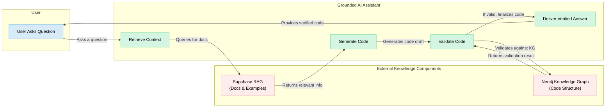

[](https://mseep.ai/app/botingw-langgraph-dev-navigator)

- For bug report, use issues
- For real-time chat, community support, and to share your ideas, [Join our Discord](https://discord.gg/j7hqkas36K) 
- Have specific feedback or want a personal demo? [Book a Chat on my Calendar](https://calendar.app.google/xx3S3CuKSBAt9d9Y7)

# LangGraph-Dev-Navigator: Build Reliable AI with Grounded Assistants

AI coding assistants are powerful, but their general knowledge can be outdated or lead to plausible-but-incorrect code ("hallucinations"). This repository addresses that by providing a framework to ground an AI assistant in the **executable truth** of a specific, version-controlled codebase.

The goal is to create a development environment where AI-generated code is more reliable, robust, and aligned with project-specific best practices.

## A Developer's Workflow: Before and After

This framework is designed to transform your daily development experience.

### Before: The Standard AI Assistant Workflow
1.  **The Prompt:** A developer asks a generic AI assistant: "Show me how to add memory to a LangGraph agent."
2.  **The AI's Response:** The AI, relying on its vast but general training data, generates a plausible-looking code snippet. However, the snippet might use a function that was deprecated two months ago, or instantiate a class with parameters that are subtly incorrect for the `langgraph` version you're using.
3.  **The Debuging Cycle:** The code fails to run. The developer copies the error message back to the AI, starting a lengthy back-and-forth conversation to debug the AI's own hallucinated code.
4.  **The Result:** The developer loses time and trust, doing manual debugging that the AI was supposed to prevent.

### After: The Grounded Assistant Workflow
1.  **The Prompt:** A developer asks the `LangGraph-Dev-Navigator` assistant: **"How do I add persistence to my graph?"**
2.  **Grounded Response:** The assistant uses `perform_rag_query` to find the canonical documentation on persistence *from your specific version of LangGraph*. It then uses `search_code_examples` to find a relevant, runnable example from the same source.
3.  **Validated Code:** The assistant generates the necessary code. It then automatically uses `check_ai_script_hallucinations` to validate its own output against the actual library structure, ensuring it uses the correct classes and methods.
4.  **The Result:** You get working, reliable code in minutes, with high confidence that it is correct for your environment.

## Our Philosophy: Metric-Driven AI Improvement

We treat the enhancement of AI development assistance as a scientific endeavor. This project is a living experiment to systematically improve the reliability of AI assistants on `LangGraph` development. We measure our success by tracking key metrics:

*   **Reduction in Hallucinations:** A quantifiable decrease in the generation of incorrect code.
*   **Increased Development Autonomy:** A reduction in the number of conversational turns needed to complete a task.
*   **Improved First-Pass Success Rate:** An increase in the percentage of AI-generated code that runs correctly without human modification.

By using this framework, you are not just getting a tool; you are participating in a structured approach to making AI a more reliable and efficient development partner.

## How It Works



This project empowers developers to build robust, reliable, and well-documented LangGraph applications by ensuring AI-generated code adheres to best practices and leverages official, version-controlled documentation. It achieves this through two primary mechanisms:

1.  **A Local Knowledge Source:** It uses a local git submodule of the official `langchain-ai/langgraph` repository as the ground truth for documentation and code structure.
2.  **An Advanced Knowledge Server:** It includes the `mcp-crawl4ai-rag` server, which provides two powerful capabilities:
    *   **Retrieval-Augmented Generation (RAG):** Performs semantic search across the entire LangGraph documentation. This allows an AI assistant to find the most relevant, up-to-date information to answer questions and generate accurate code.
    *   **Knowledge Graph (KG):** Ingests the `langgraph` codebase into a graph database. This allows the server to validate AI-generated code against the actual structure of the library, drastically reducing code "hallucinations" (e.g., usage of non-existent functions or incorrect parameters).

## Getting Started

For a high-level overview of the project's components, see the [Architecture Diagram](images/architecture.md).

This guide provides a comprehensive, step-by-step walkthrough for setting up the `langgraph-dev-navigator` and all its features.

### Step 1: Clone the Repository and Submodules

This step clones the main repository and the required `langgraph` submodule, which serves as the local knowledge source.

1.  **Clone the Repository:**
    ```bash
    git clone --recursive https://github.com/botingw/langgraph-dev-navigator.git
    cd langgraph-dev-navigator
    ```

2.  **Initialize Submodules (if not cloned recursively):**
    If you cloned the repository without the `--recursive` flag, you must initialize the submodules manually:
    ```bash
    git submodule update --init --recursive
    ```

### Step 2: Install Core Dependencies

Install the required Python packages for the project. they are dependencies for langgraph development.

```bash
# from the root of the langgraph-dev-navigator directory
uv pip install -r requirements.txt
```

### Step 3: Set Up the Knowledge Server

This section activates the powerful RAG and Knowledge Graph capabilities of the project by configuring and launching the `mcp-crawl4ai-rag` server submodule.

**Are you a hosted (remote) MCP client only?** Skip local setup and read the [Remote MCP Client Quickstart](memory/docs/remote_client/README.md) for the lightweight flow (hosted URL + attached `langgraph-ai-rules_v4_1.md`, no need to clone this repo).

You have three paths:
- **Path A/B (Local):** Run your own backend. Complete all substeps (3.1–3.5).
- **Path C (Hosted MCP / Remote only):** If you received the hosted URL from the maintainer, skip local backend setup, use Path C to configure your client, then jump to Step 4. The real URL is shared privately; the placeholder remains in this repo.

#### 3.1: Prerequisites

Before you begin, ensure you have the following:

*   **Docker:** For the recommended container-based setup.
*   **Python 3.12+ & uv:** Required for the local development path and validation scripts.
*   **API Keys & Credentials:**
    *   **OpenAI API Key:** Required for generating embeddings for the RAG system. [Get your API Key here](https://platform.openai.com/api-keys).
    *   **Supabase Project:** Used as a vector database to store the LangGraph documentation for RAG. [Create a Supabase project](https://supabase.com/dashboard/projects). You will need your Project URL and `service_role` key.
    *   **Neo4j Instance:** Used as a graph database for the Knowledge Graph. [Sign up for Neo4j AuraDB (cloud)](https://neo4j.com/cloud/platform/aura-graph-database/) or [Install Neo4j Desktop (local)](https://neo4j.com/download/).

Here is the [video](https://youtu.be/_jaMnT0G4So?si=ZHBqm9fGg-Y3gXhk) for Supabase, Neo4j, OpenAI API key setup guide. 

For more detailed information on setting up these services, refer to the [Database Setup (GitHub)](./mcp-crawl4ai-rag#database-setup) | [Database Setup (Local)](mcp-crawl4ai-rag/README.md#database-setup) and [Knowledge Graph Setup (GitHub)](./mcp-crawl4ai-rag#knowledge-graph-setup-optional) | [Knowledge Graph Setup (Local)](mcp-crawl4ai-rag/README.md#knowledge-graph-setup-optional) sections in the submodule's README.

#### 3.2: Configure Environment Variables

1.  Navigate to the `mcp-crawl4ai-rag` directory.
2.  Create a `.env` file by copying the example file. The example file is pre-configured with the recommended settings for this project.
    ```bash
    cp mcp-crawl4ai-rag/.env.example mcp-crawl4ai-rag/.env
    ```
3.  Edit `mcp-crawl4ai-rag/.env` and fill in your API keys and service URLs from the prerequisites. If do not know where to find environment variables for Supabase, neo4j, OpenAI API key, this [video](https://youtu.be/_jaMnT0G4So?si=ZHBqm9fGg-Y3gXhk) is helpful. 

##### Understanding Key Configurations

The `.env.example` file is set up with the following recommended defaults:

*   `TRANSPORT='stdio'`: This is the recommended setting. It allows your AI coding assistant to start and stop the MCP server on demand, which is the most seamless experience. You might change this to `sse` if you plan to have multiple different clients connect to a single, long-running server instance.
*   `USE_KNOWLEDGE_GRAPH=true`: This enables the powerful AI code hallucination checker.
*   `USE_AGENTIC_RAG=true`: This enables the specialized tool for finding code examples.
*   `NEO4J_URI='bolt://host.docker.internal:7687'`: This is the correct setting for the **recommended Docker setup**, as it allows the container to connect to the Neo4j database running on your host machine. If you are using the **advanced local setup**, you should change this to `bolt://localhost:7687`.

For a detailed explanation of all available RAG strategies and other advanced settings, please see the [Configuration (GitHub)](./mcp-crawl4ai-rag#configuration) | [Configuration (Local)](mcp-crawl4ai-rag/README.md#configuration) section in the submodule's README.

#### 3.3: Set Up the Supabase Database

This is a one-time setup step to prepare your Supabase project to store the crawled documentation.

1.  Navigate to the **SQL Editor** in your Supabase project dashboard.
2.  Click **"New query"**.
3.  Copy the entire content of the `mcp-crawl4ai-rag/crawled_pages.sql` file and paste it into the query editor.
4.  Click **"Run"** to execute the script and create the necessary tables and functions.

#### 3.4: Choose Your Server Setup Path

Now, choose one of the following paths to install and run the MCP server.

##### Path A: Docker Setup (Local, Recommended)

This is the simplest way to get started.

1.  **Build the Docker Image:**
    ```bash
    docker build -t mcp-crawl4ai-rag -f mcp-crawl4ai-rag/Dockerfile mcp-crawl4ai-rag
    ```

    Then, run the validation script in a temporary container (validate your `.env` enables you to connect to neo4j and Supabase):
    ```bash
    docker run --rm --memory "512m" -v "$(pwd)/.env:/app/.env" mcp-crawl4ai-rag python -u validate_setup.py --stage 1
    ```

2.  **Run the One-Time Data Ingestion:**
    This command runs a temporary container to crawl the documentation and populate your Supabase and Neo4j databases.
    ```bash
    docker run --rm --memory "512m" \
      -v "$(pwd)/mcp-crawl4ai-rag/.env:/app/.env" \
      -v "$(pwd)/mcp-crawl4ai-rag/reports:/app/reports" \
      mcp-crawl4ai-rag \
      python -u run_one_time_ingestion.py
    ```

    then validate successful data ingestion.
    ```bash
    docker run --rm --memory "512m" -v "$(pwd)/.env:/app/.env" mcp-crawl4ai-rag python -u validate_setup.py --stage 2
    ```

3.  **Configure Your AI Assistant to Launch the Server:**
    The following are examples of how to configure your AI coding assistant to connect to the server. For more detailed configurations, please refer to the [mcp-crawl4ai-rag/README.md (GitHub)](./mcp-crawl4ai-rag) | [mcp-crawl4ai-rag/README.md (Local)](mcp-crawl4ai-rag/README.md).

    *   **For Gemini CLI (`.gemini/settings.json`):**
        ```json
        {
          "mcpServers": {
            "crawl4ai-rag-bash": {
              "command": "docker",
              "args": ["run", "-i", "--rm",
                       "--memory", "512m",
                       "-v", "${pwd}/.env:/app/.env",
                       "mcp-crawl4ai-rag",
                       "bash", "/app/start_mcp_server.sh"],
              "timeout": 600
            }
          }
        }
        ```

    *   **For GitHub Copilot (`.vscode/mcp.json`):**
        ```json
        {
          "servers": {
            "crawl4ai-rag": {
              "type": "stdio",
              "command": "docker",
              "args": ["run", "-i",
                       "--memory", "512m",
                       "-v", "$(pwd)/.env:/app/.env",
                       "mcp-crawl4ai-rag",
                       "bash", "/app/start_mcp_server.sh"]
            }
          }
        }
        ```
    **Note:** `$(pwd)` should be the absolute path to the `mcp-crawl4ai-rag` submodule.

##### Path B: Local Development Setup (Advanced)

This path is for developers who want to work on the server code directly.

1. Install uv if you don't have it:
   ```bash
   pip install uv
   ```

2. Create and activate a virtual environment from within the `mcp-crawl4ai-rag` directory:
   ```bash
   cd mcp-crawl4ai-rag
   uv venv
   source .venv/bin/activate # On Windows, use: .venv\Scripts\activate
   ```

3. Install dependencies:
   ```bash
   uv pip install -e .
   crawl4ai-setup
   ```

4. run the validation script in a temporary container (validate your `.env` enables you to connect to neo4j and Supabase)
    ```bash
    uv run python validate_setup.py --stage 1
    ```

5.  Run the One-Time Data Ingestion:
    ```bash
    uv run python run_one_time_ingestion.py
    ```

6.  Launch the MCP Server:
    The following are examples of how to configure your AI coding assistant to connect to the server. For more detailed configurations on configuring your specific AI assistant for local development, please refer to the `mcp-crawl4ai-rag/README.md`.
    For more advanced local mcp launch options (e.g. sse server), refer to the `mcp-crawl4ai-rag/README.md` "Integration with MCP Clients" [section (GitHub)](./mcp-crawl4ai-rag#integration-with-mcp-clients) | [section (Local)](mcp-crawl4ai-rag/README.md#integration-with-mcp-clients) for detailed instructions on configuring your specific AI assistant for local development.

    for gemini cli (configured in ./gemini/setting.json):
    ```json
    {
      "mcpServers": {
        "crawl4ai-rag-local-bash": {
          "command": "${pwd}/start_mcp_server.sh",
          "env": {
            "TRANSPORT": "stdio",
            "OPENAI_API_KEY": "{api-key}",
            "SUPABASE_URL": "https://{your-id}.supabase.co",
            "SUPABASE_SERVICE_KEY": "api-key",
            "USE_KNOWLEDGE_GRAPH": "true",
            "NEO4J_URI": "bolt://localhost:7687",
            "NEO4J_USER": "neo4j",
            "NEO4J_PASSWORD": "{password}"
          },
          "timeout": 600
        }
      }
    }
    ```

    for github copilot (configured in .vscode/mcp.json):

    ```json
    {
      // 💡 Inputs are prompted on first server start, then stored securely by VS Code.
      "inputs": [
        {
          "type": "promptString",
          "id": "perplexity-key",
          "description": "Perplexity API Key",
          "password": true
        }
      ],
      "servers": {
        "crawl4ai-rag": {
          "type": "stdio",
          "command": "$(pwd)/start_mcp_server.sh"
        }
      }
    }
    ```

    **Note:** `$(pwd)` should be the absolute path to the `mcp-crawl4ai-rag` submodule.

##### Path C: Hosted MCP Server (Remote Only, No Backend Setup)

If you are an early adopter using the hosted deployment, you **do not** need any backend setup. Ask the maintainer privately for the actual URL (kept out of this public repo). Replace `{deployed-remote-http-mcp-server-url}` with the URL you receive:

- **Claude CLI**
  ```bash
  claude mcp add --transport http crawl4ai-rag-http-remote {deployed-remote-http-mcp-server-url}
  ```

- **GitHub Copilot**
  ```json
  {
    "servers": {
      "crawl4ai-rag-http-remote": {
        "url": "{deployed-remote-http-mcp-server-url}",
        "type": "http"
      }
    },
    "inputs": []
  }
  ```

Remote users should continue to Step 4 using the `langgraph-ai-rules_v4_1.md` instructions; local install users keep their existing rule selection.

#### 3.5: Validate the Server Setup

Only required for local Path A/B. Remote Path C users can skip this step.

After completing your local setup path, run the validation script again from within the `mcp-crawl4ai-rag` directory to ensure everything is working correctly (data write into):

```bash
# Ensure you are in the mcp-crawl4ai-rag directory
cd mcp-crawl4ai-rag
uv run python validate_setup.py --stage 2
```

### Step 4: Configure Your AI Assistant

This final step installs the project-specific instructions for your AI coding assistant, enabling it to use the knowledge server and follow the correct development methodology.

* Remote users (hosted MCP) should use the v4.1 rules: `uv run python src/setup_dev_assistant.py --rule-file langgraph-ai-rules_v4_1.md`
* Local install users should keep their current rule selection (no change required), i.e., run without `--rule-file`.

Run the following command and select your assistant from the interactive menu:
```bash
uv run python src/setup_dev_assistant.py
```

## Advanced Usage & Recipes

### Key Tools Unlocked by the MCP Server

Once the MCP server is running, your AI assistant gains access to a powerful new set of tools:

*   `perform_rag_query`: Asks a natural language question (e.g., "How do I add memory to a graph?") and gets back the most relevant sections of the LangGraph documentation.
*   `search_code_examples`: Searches specifically for runnable code snippets from the documentation.
*   `check_ai_script_hallucinations`: Takes a Python script as input and validates it against the Knowledge Graph to check for non-existent classes, methods, or incorrect function calls.
*   `query_knowledge_graph`: Allows for direct exploration of the LangGraph codebase structure via graph queries.

### Aligning Docs & Code Version

This is an optional but recommended step to ensure the documentation source (for AI assistants to generate code) perfectly matches the version of the `langgraph` library you have installed.

1.  **Find your installed package version:**
    ```bash
    pip show langgraph
    ```
    (Look for the `Version:` line, e.g., `0.0.56`)

2.  **Align the submodule to that version tag and commit the change:**
    ```bash
    # Go into the submodule, check out the tag, then go back
    (cd langgraph && git fetch --all --tags && git checkout tags/v0.0.56)

    # Commit the new version pointer to your main project
    git add langgraph
    git commit -m "Align langgraph submodule with v0.0.56"
    ```
    *(Remember to replace `v0.0.56` with the version you found in step 1.)*

## Project Documentation

*   `docs/project_management_guide.md`: The standard process for managing epics, stories, and tasks.
*   `memory/tasks/epic_user_experience/README.md`: The strategic plan for the User Experience epic.

## Contributing

... (Add your contribution guidelines here) ...
