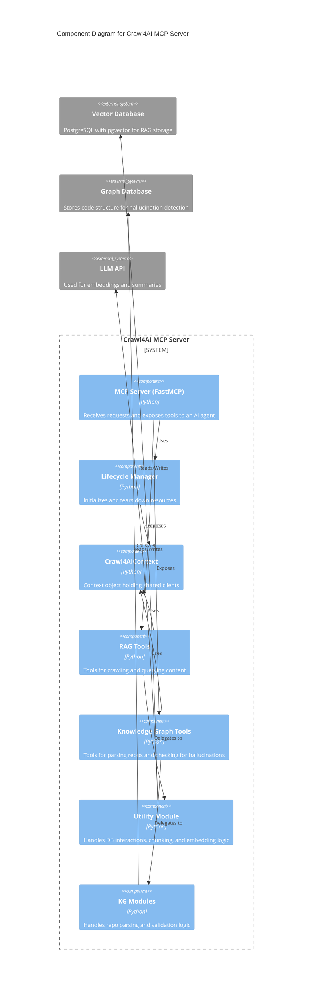
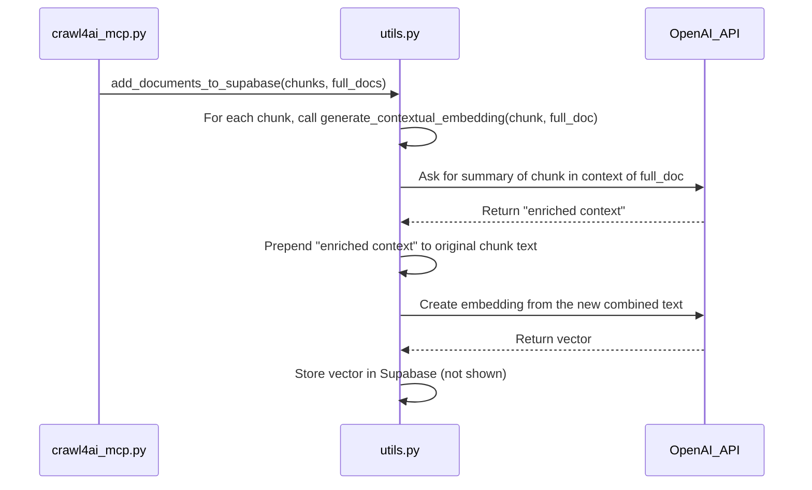
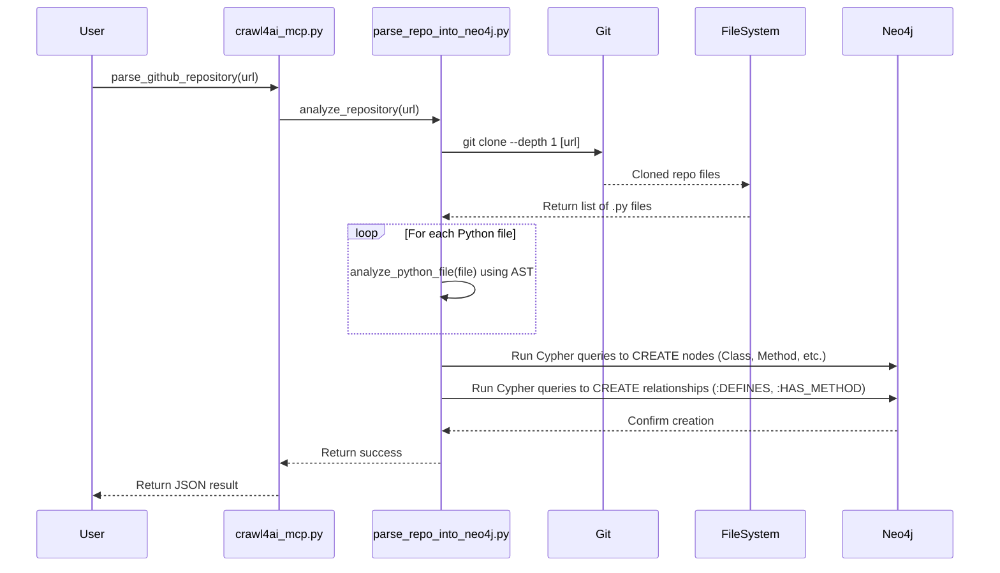

# Crawl4AI MCP Server: Architectural Analysis

This document provides a top-down architectural analysis of the Crawl4AI MCP Server project. The analysis is based on static examination of the project's source files.

---

## 1. High-Level Architecture

This project is a **self-contained, monolithic server application** designed to provide specialized tools to a parent AI agent or assistant. It operates under the **Model-Context Protocol (MCP)**.

Its architecture is defined by two primary, distinct functionalities:

1.  **Web Crawling & RAG System**: This is the core information retrieval function. It uses `crawl4ai` to scrape web content, processes it, and stores it in a `Supabase` (PostgreSQL) database with vector embeddings for semantic search.

2.  **Knowledge Graph & AI Hallucination Detection**: This is a specialized code analysis function. It parses Python repositories, builds a structural model of the code in a `Neo4j` graph database, and provides tools to validate new code against this model.

#### Component Descriptions

*   **External Systems**:
    *   `Supabase`: The external cloud database for storing crawled text and vector embeddings.
    *   `Neo4j`: The external graph database for storing code structures.
    *   `OpenAI`: The external API service used for generating summaries and embeddings.
*   **Internal Components**:
    *   `MCP Server (FastMCP)`: The core web server that listens for requests and exposes tools over the MCP protocol.
    *   `Lifecycle Manager`: A manager that initializes all services (database clients, crawlers) on startup and cleans them up on shutdown.
    *   `Crawl4AIContext`: A data object that holds and provides access to all shared resources and clients.
    *   `RAG Tools`: The set of functions exposed to the AI agent for crawling websites and performing RAG queries (e.g., `smart_crawl_url`).
    *   `Knowledge Graph Tools`: The set of functions exposed for parsing code and checking for hallucinations (e.g., `parse_github_repository`).
    *   `Utility Module (utils.py)`: An internal helper module containing the logic for database interactions, data processing, and calling the OpenAI API.
    *   `KG Modules (knowledge_graphs/*)`: Internal modules containing the logic for cloning Git repos, parsing code with AST, and building the Neo4j graph.

---

## 2. Application Core (`src/crawl4ai_mcp.py`)

The entry point file, `src/crawl4ai_mcp.py`, acts as the central nervous system for the application. It demonstrates several strong architectural patterns.

*   **Composition Root**: This file is where all independent components (database clients, crawlers, validators) are instantiated and "wired together" at the start of the application.
*   **Lifecycle Management & Dependency Injection**: The `crawl4ai_lifespan` function uses `@asynccontextmanager` to manage the application's state. It initializes all necessary clients, bundles them into a `Crawl4AIContext` object, and this context is then **injected** as the `ctx` argument into every tool function.
*   **Configuration-Driven Strategy Pattern**: The server's features (e.g., reranking, knowledge graph) are enabled or disabled based on environment variables checked within the `crawl4ai_lifespan` function. This allows the server's behavior to be changed purely through configuration.

---

## 3. Utility and Data-Access Layer (`src/utils.py`)

This file is a classic **Utility/Helper Module**. Its purpose is to encapsulate and isolate all direct interactions with external services (OpenAI, Supabase) and to contain complex data-processing logic.

#### Key Responsibilities & Patterns:

1.  **Client Initialization (`get_supabase_client`)**: A **Factory Function** that centralizes the creation of the Supabase client.

2.  **Embedding Generation (`create_embeddings_batch`)**: Acts as a **Service Gateway** or **Facade** for the OpenAI embeddings API. It also implements a **Retry with Exponential Backoff** pattern for resilience, gracefully degrading to individual embeddings if a batch call fails.

3.  **Data Persistence (`add_documents_to_supabase`, `add_code_examples_to_supabase`)**: Implements a simplified **Repository Pattern**. These functions are responsible for all `INSERT` and `DELETE` operations. They use a **Delete-then-Insert** strategy to ensure data freshness and process data in batches to manage memory and API limits.

4.  **Data Retrieval (`search_documents`, `search_code_examples`)**: These functions handle all query logic, calling the appropriate SQL functions in Supabase to perform vector similarity searches.

#### Contextual Embedding Data Flow

This diagram shows how `utils.py` enriches data when `USE_CONTEXTUAL_EMBEDDINGS` is true.

---

## 4. Knowledge Graph Engine (`knowledge_graphs/parse_repo_into_neo4j.py`)

This module is a self-contained **Extractor/Parser** system. Its sole responsibility is to convert an unstructured code repository into a structured, queryable graph in Neo4j.

It is composed of two main classes that separate responsibilities:

1.  **`Neo4jCodeAnalyzer` (The "What")**: A stateless parser that takes a single Python file and uses the `ast` (Abstract Syntax Tree) module to extract a structured dictionary of its classes, methods, and functions.

2.  **`DirectNeo4jExtractor` (The "How" and "Where")**: The stateful orchestrator that manages the entire process. It handles the `git clone` operation, uses the `Neo4jCodeAnalyzer` to parse each file, and then translates the resulting dictionary into a series of Cypher queries to build the graph in Neo4j.

#### Repository Parsing Process Flow

This diagram illustrates the end-to-end process orchestrated by the `DirectNeo4jExtractor`.

