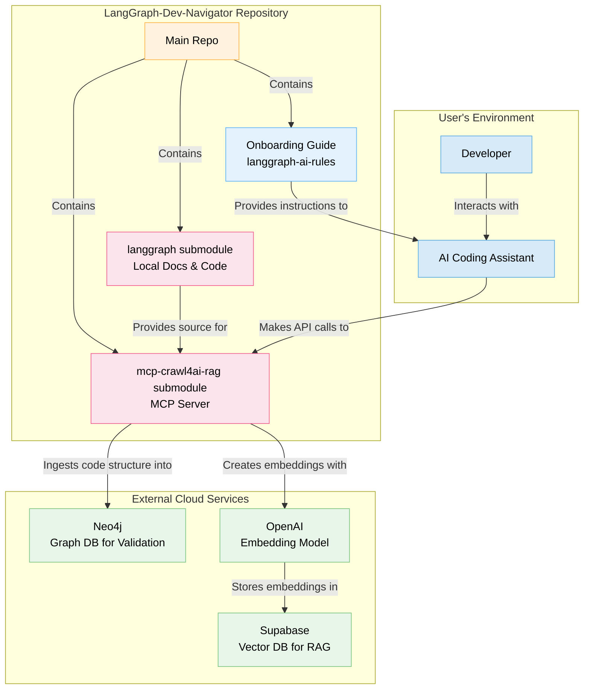

```mermaid
graph TD
    %% Style Definitions
    classDef repo fill:#FFF3E0,stroke:#FFB74D,color:#000
    classDef user fill:#D6EAF8,stroke:#5DADE2,color:#000
    classDef service fill:#E8F5E9,stroke:#81C784,color:#000
    classDef submodule fill:#FCE4EC,stroke:#F06292,color:#000
    classDef rules fill:#E3F2FD,stroke:#64B5F6,color:#000

    subgraph "User's Environment"
        U[Developer]:::user
        A[AI Coding Assistant]:::user
    end

    subgraph "LangGraph-Dev-Navigator Repository"
        LGN[Main Repo]:::repo
        Rules[Onboarding Guide<br>langgraph-ai-rules]:::rules
        LG[langgraph submodule<br>Local Docs & Code]:::submodule
        MCP[mcp-crawl4ai-rag submodule<br>MCP Server]:::submodule
    end

    subgraph "External Cloud Services"
        S[Supabase<br>Vector DB for RAG]:::service
        N[Neo4j<br>Graph DB for Validation]:::service
        O[OpenAI<br>Embedding Model]:::service
    end

    %% Connections
    U -- "Interacts with" --> A
    
    %% Configuration of the Assistant
    LGN -- "Contains" --> Rules
    Rules -- "Provides instructions to" --> A

    %% Submodule Structure
    LGN -- "Contains" --> LG
    LGN -- "Contains" --> MCP

    %% Data Ingestion Flow (Setup Time)
    LG -- "Provides source for" --> MCP
    MCP -- "Ingests code structure into" --> N
    MCP -- "Creates embeddings with" --> O
    O -- "Stores embeddings in" --> S

    %% Runtime Flow (When user asks a question)
    A -- "Makes API calls to" --> MCP
```
