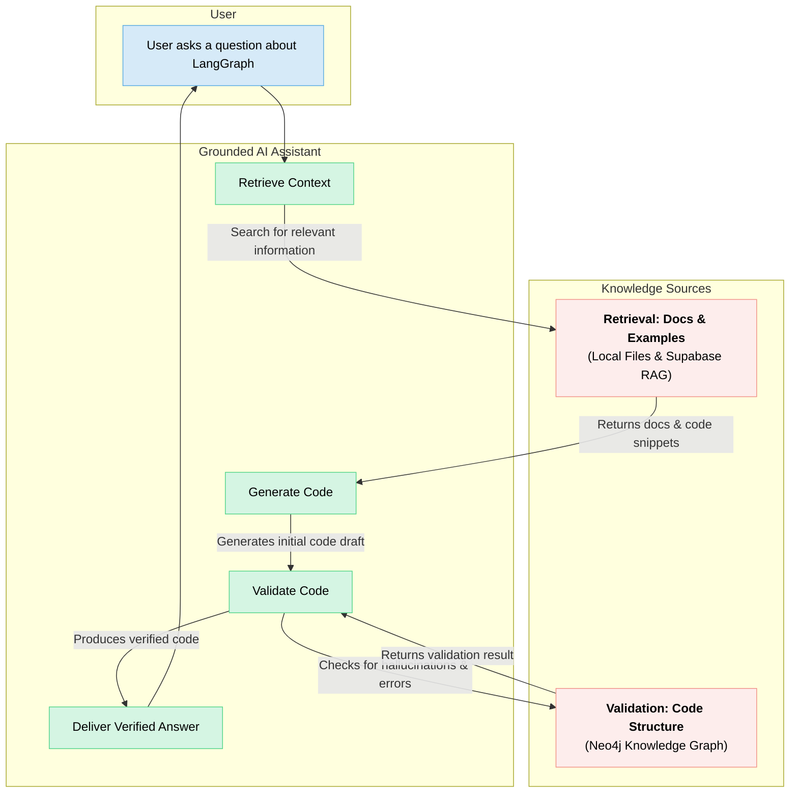

```mermaid
graph TD
    %% Styles - Added color for better readability
    classDef user fill:#D6EAF8,stroke:#5DADE2,color:#000000
    classDef assistant fill:#D5F5E3,stroke:#58D68D,color:#000000
    classDef knowledge fill:#FDEDEC,stroke:#F1948A,color:#000000

    subgraph "User"
        U[User asks a question about LangGraph]:::user
    end

    subgraph "Grounded AI Assistant"
        A[Retrieve Context]:::assistant
        B[Generate Code]:::assistant
        C[Validate Code]:::assistant
        D[Deliver Verified Answer]:::assistant
    end

    subgraph "Knowledge Sources"
        Retrieval["<b>Retrieval: Docs & Examples</b><br>(Local Files & Supabase RAG)"]:::knowledge
        Validation["<b>Validation: Code Structure</b><br>(Neo4j Knowledge Graph)"]:::knowledge
    end

    %% Connections
    U --> A
    A -- "Search for relevant information" --> Retrieval
    Retrieval -- "Returns docs & code snippets" --> B
    B -- "Generates initial code draft" --> C
    C -- "Checks for hallucinations & errors" --> Validation
    Validation -- "Returns validation result" --> C
    C -- "Produces verified code" --> D
    D --> U
```
