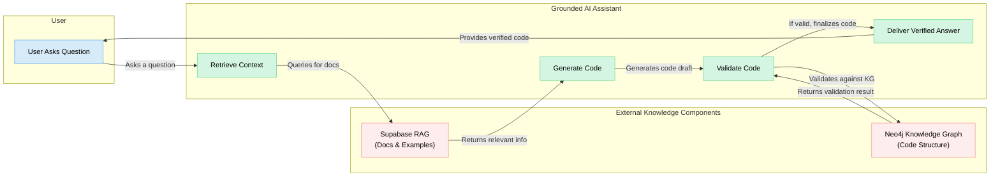

```mermaid
graph LR
    %% Style Definitions
    classDef user fill:#D6EAF8,stroke:#5DADE2,color:#000
    classDef assistant fill:#D5F5E3,stroke:#58D68D,color:#000
    classDef component fill:#FDEDEC,stroke:#F1948A,color:#000

    %% Define Nodes and Subgraphs
    subgraph User
        U[User Asks Question]:::user
    end

    subgraph "Grounded AI Assistant"
        A[Retrieve Context]:::assistant
        B[Generate Code]:::assistant
        C[Validate Code]:::assistant
        D[Deliver Verified Answer]:::assistant
    end

    subgraph "External Knowledge Components"
        RAG["Supabase RAG<br>(Docs & Examples)"]:::component
        KG["Neo4j Knowledge Graph<br>(Code Structure)"]:::component
    end

    %% Define Connections with Actions
    U -- "Asks a question" --> A
    A -- "Queries for docs" --> RAG
    RAG -- "Returns relevant info" --> B
    B -- "Generates code draft" --> C
    C -- "Validates against KG" --> KG
    KG -- "Returns validation result" --> C
    C -- "If valid, finalizes code" --> D
    D -- "Provides verified code" --> U
```
