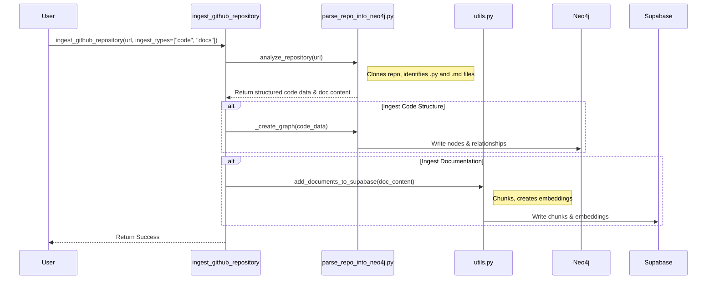

# Plan: Extending RAG to GitHub Repository Documentation

This document outlines a high-level plan to extend the server's functionality, enabling it to ingest documentation from a GitHub repository (e.g., `README.md`, tutorials) and make it available for Retrieval-Augmented Generation (RAG) queries.

**Goal**: Unify the repository analysis capabilities so that a single command can process a repository for both code structure (for the Knowledge Graph) and documentation content (for RAG).

---

### High-Level Plan

The proposed solution leverages the server's existing architectural components—the repository cloning mechanism and the RAG ingestion pipeline—to create a new, more comprehensive tool.

#### Step 1: Enhance the File Identification Logic

The current process in `knowledge_graphs/parse_repo_into_neo4j.py` only identifies `.py` files for analysis.

*   **Action**: Modify the file discovery function (`get_python_files`) or create a new one (`get_repository_files`) to identify both Python source files and documentation files (e.g., `.md`, `.mdx`, `.rst`). This function should return a structured result separating the files by type, such as `{'code': [...], 'docs': [...]}`.

#### Step 2: Modify the Orchestrator to Handle Documentation

The `DirectNeo4jExtractor.analyze_repository` method, which orchestrates the repository analysis, needs to be updated to handle the newly identified documentation files.

*   **Action**: The orchestrator will read the full content of all identified documentation files and prepare this content to be passed up to the tool layer for RAG processing.

#### Step 3: Create a New, Unified Tool

To avoid overloading the existing `parse_github_repository` tool, a new, more powerful tool should be introduced in `src/crawl4ai_mcp.py`.

*   **Action**: Create a new tool named `ingest_github_repository`.
*   **Proposed Parameters**: The tool should accept the `repo_url` and an optional list parameter, `ingest_types: list[str] = ["code", "docs"]`. This will give the user flexible control over what content to ingest.

#### Step 4: Implement the RAG Ingestion Pipeline for Docs

The new tool will leverage the existing, robust RAG pipeline from `src/utils.py`.

*   **Action**:
    1.  When `"docs"` is specified in `ingest_types`, the tool will receive the content of all Markdown files from the analysis step.
    2.  It will generate a unique `source_id` for the repository (e.g., `github.com/user/repo`).
    3.  It will then pass the documentation content to the existing RAG pipeline functions in `utils.py` (`add_documents_to_supabase`), which will handle chunking, embedding, and storing the content in the `crawled_pages` table.

---

### Proposed Workflow Visualization

This sequence diagram illustrates how the new `ingest_github_repository` tool would orchestrate the dual-ingestion process, feeding data to both Neo4j and Supabase.

